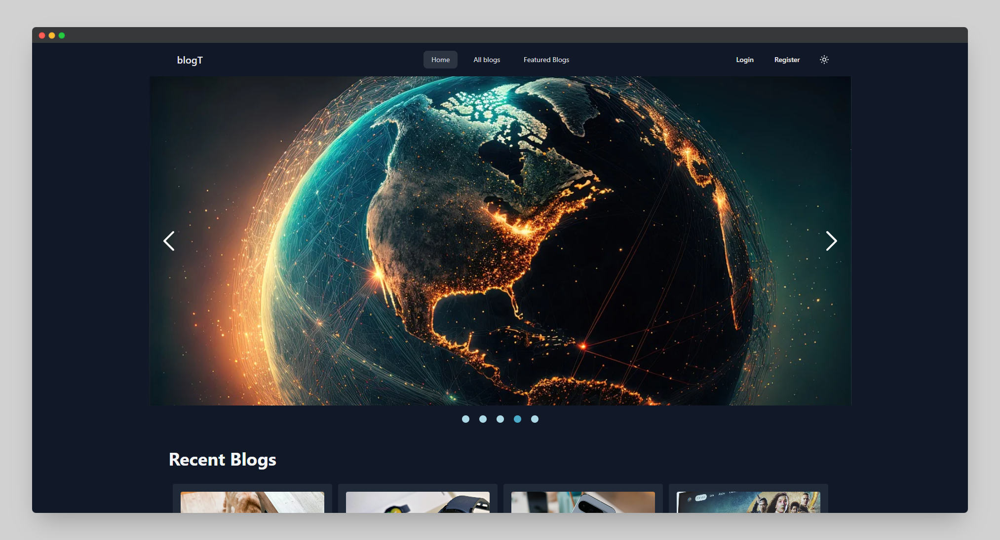
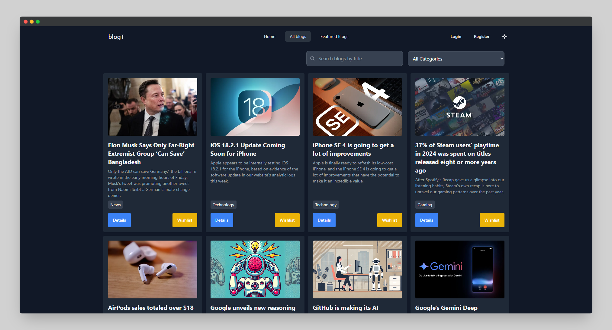

# blogT

## 🚀 Introduction

**blogT** is a dynamic blog website that allows users to read, comment, and interact with tech blogs. The platform offers **blog searching, category-based filtering, wishlist management**, and **user authentication** for a personalized experience. Built with modern web technologies like **React, Firebase, and MongoDB**, it ensures a smooth and engaging user experience.

🔗 **Live URL:** [blogT](https://blogt-8ebbb.web.app/)

---

## 📸 Screenshots

### 🔹 Home Page


### 🔹 All Blogs Page


---

## 🌟 Features

- **🔐 User Authentication** – Email/password login & additional authentication methods.
- **🔎 Search & Filter** – Search blogs by title and filter by categories.
- **📌 Wishlist** – Save favorite blogs for later reading.
- **💬 Commenting System** – Users can comment on blogs but not on their own.
- **🔥 Featured Blogs** – Display the **top 10 blogs** based on content length.
- **💡 Responsive UI** – Optimized for **mobile, tablet, and desktop** screens.

---

## ⚙️ Installation

### Prerequisites

Ensure you have the following installed:

- **[Node.js](https://nodejs.org/)** (v18+)
- **[npm](https://www.npmjs.com/)**
- **[Vite](https://vitejs.dev/)** (for development)

### Steps

1. **Clone the repository**:

   ```sh
   git clone https://github.com/your-username/blogT.git
   cd blogT
   
2. **Install dependencies**:

   ```sh
   npm install
   ```

3. **Run the development server**:

   ```sh
   npm run dev
   ```

4. **Build the project** (for production):

   ```sh
   npm run build
   ```

5. **Preview the built project**:

   ```sh
   npm run preview
   ```

---

## 🎯 Usage

### Running the Project

1. Navigate to `http://localhost:5173/` in your browser after running `npm run dev`.
2. Register/Login using **Email & Password** or other authentication methods.
3. Browse blogs, search by title, filter by category, and add blogs to the wishlist.
4. If authenticated, you can **comment** on blogs (except your own).
   
---

## 🛠️ Technologies Used

- **Frontend:** React, React Router, Framer Motion, Tailwind CSS, DaisyUI
- **Authentication:** Firebase Authentication
- **Data Management:** Axios, JSON Web Tokens (JWT)
- **UI Enhancements:** SweetAlert2, React Icons, React Photo View
- **State Management:** LocalForage, Context API
- **Animation & UX:** React Intersection Observer, Lottie React, Motion

---

## 📁 Project Structure

```
blogT/
│── src/
│   ├── components/      # Reusable UI components
│   ├── pages/           # Pages (Home, Login, Registration, etc.)
│   ├── providers/       # Context API Providers (Auth, Theme)
│   ├── routes/          # Application routes
│   ├── styles/          # CSS/Tailwind styles
│   ├── utils/           # Utility functions
│   ├── App.js           # Main App component
│   ├── main.jsx         # Entry point
│── public/              # Static assets
│── screenshots/         # Screenshot images
│── package.json         # Project dependencies & scripts
│── vite.config.js       # Vite configuration
│── README.md            # Project documentation
```
